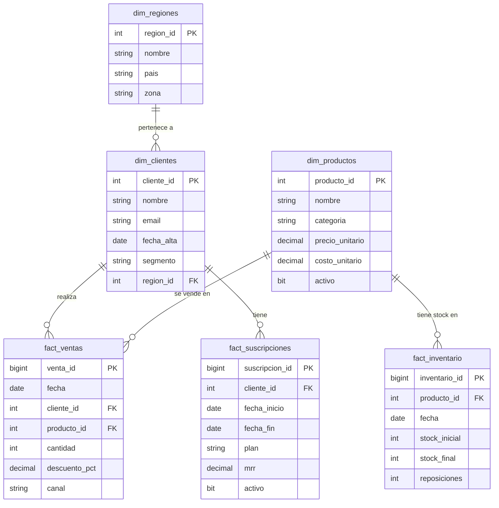

# Diagrama Entidad-Relación (ER)

El siguiente diagrama muestra las relaciones entre las tablas del dataset del curso.

```mermaid
erDiagram
    dim_clientes ||--o{ fact_ventas : "realiza"
    dim_clientes ||--o{ fact_suscripciones : "tiene"
    dim_productos ||--o{ fact_ventas : "se vende en"
    dim_productos ||--o{ fact_inventario : "tiene stock en"
    dim_regiones ||--o{ dim_clientes : "pertenece a"

    dim_clientes {
        int cliente_id PK
        string nombre
        string email
        date fecha_alta
        string segmento
        int region_id FK
    }

    dim_productos {
        int producto_id PK
        string nombre
        string categoria
        decimal precio_unitario
        decimal costo_unitario
        bit activo
    }

    dim_regiones {
        int region_id PK
        string nombre
        string pais
        string zona
    }

    fact_ventas {
        bigint venta_id PK
        date fecha
        int cliente_id FK
        int producto_id FK
        int cantidad
        decimal descuento_pct
        string canal
    }

    fact_suscripciones {
        bigint suscripcion_id PK
        int cliente_id FK
        date fecha_inicio
        date fecha_fin
        string plan
        decimal mrr
        bit activo
    }

    fact_inventario {
        bigint inventario_id PK
        int producto_id FK
        date fecha
        int stock_inicial
        int stock_final
        int reposiciones
    }
```
